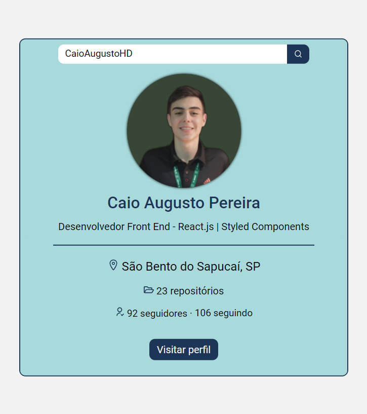

<h1 align="center">GitHub users info</h1>
<h4 align="center">Veja os dados de qualquer usuário do GitHub!</h4>
<h4 align="center">Feito com React e TypeScript</h4>

 &#xa0;

**
Sumário
**

<a href="#dart-sobre">Sobre</a> &#xa0; | &#xa0;
<a href="#white_check_mark-funcionalidades">Funcionalidades</a> &#xa0; | &#xa0;
<a href="#computer-tecnologias">Tecnologias</a> &#xa0; | &#xa0;
<a href="#hammer_and_wrench-serviços">Serviços</a>

<a href="#camera-imagens">Imagens</a> &#xa0; | &#xa0;
<a href="#orange_book-como-usar">Como usar</a> &#xa0; | &#xa0;
<a href="#scroll-pré-requisitos">Pré-requisitos</a> &#xa0; | &#xa0;
<a href="#link-links">Links</a> &#xa0; | &#xa0;
<a href="#sparkles-autor">Autor</a>

 &#xa0;
 
## :dart: Sobre

O principal objetivo do projeto foi desenvolver o primeiro projeto utilizando a biblioteca React com TypeScript.

Se trata de um sistema de busca de usuários do GitHub, onde é possível visualizar as principais informações do perfil.

&#xa0;

## :white_check_mark: Funcionalidades
As principais funcionalidades do projeto são:

✔️ Permitir a busca de qualquer usuário do GitHub;

✔️ Exibir os principais dados do usuário buscado;

✔️ Possibilitar um link para visitar o perfil do usuário buscado;

✔️ Exibir uma mensagem de erro caso o usuário buscado não seja encontrado.

&#xa0;

## :computer: Tecnologias
* [HTML](https://developer.mozilla.org/pt-BR/docs/Web/HTML)

* [TypeScript](https://www.typescriptlang.org/)

* [React.js](https://pt-br.reactjs.org/)

* [Styled Components](https://styled-components.com/)

* [React Icons](https://react-icons.github.io/react-icons/)

* [Axios](https://axios-http.com/)

* [Vite](https://vitejs.dev/)

&#xa0;

## :hammer_and_wrench: Serviços
* <a href="https://github.com/">GitHub</a>

* <a href="https://fonts.google.com/">Google Fonts </a>- importação da fonte

* <a href="https://api.github.com/users">API GitHub  </a>- API dos usuários do GitHub

&#xa0;

## :camera: Imagens
**
Exemplo de funcionamento:
**

  

**
Captura de tela do projeto:
**

  

&#xa0;

## :orange_book: Como usar

Acesse a aplicação pelo link. Digite o nome do usuário que você deseja buscar.

Se a busca for bem sucedida, as informações do perfil serão exibidas. Caso o usuário não seja encontrado, será exibida uma mensagem de erro.

&#xa0;

## :scroll: Pré requisitos
Para utilizar o sistema, basta um navegador de sua preferência e conexão com internet.

&#xa0;

## :link: Links
* Repositório: https://github.com/CaioAugustoHD/GitHub-users-info

&#xa0;

## :sparkles: Autor

<h4>Feito por Caio Augusto Pereira</h4>

&#xa0;

 
